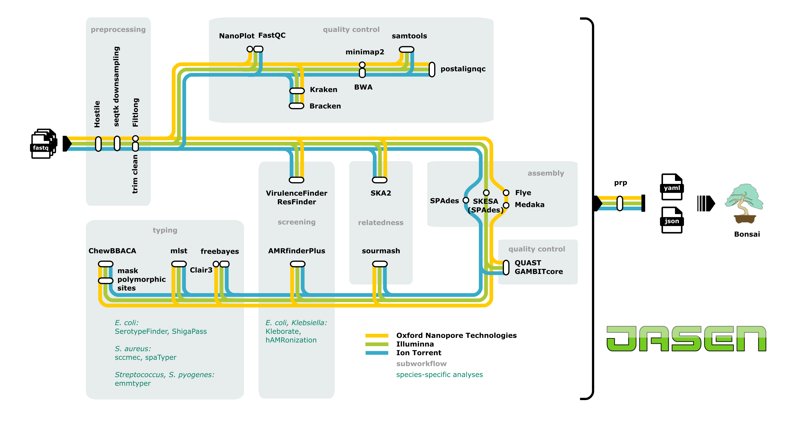

  

<h3 align="center">Just Another System for Epityping NGS data</h3>
 

Jasen produces results for antibiotic resistance and virulence prediction and epidemiological typing for surveillance purposes. The pipeline is developed in collaboration with several Swedish hospitals. The development was funded by [Genomic Medicine Sweden](https://genomicmedicine.se/).

*Flowchart depicting the main workflow in JASEN, where each line represents a sequencing platform-specific workflow. Species-specific analyses are listed in respective subworkflow. Results from all the tools are collected in final json file and can be viewed in Bonsai, a visualisation tool created to explore JASEN output. Note: *Mycobacterium tuberculosis* analysis follows a distinct workflow and is not included in this visualisation. Masking of polymorphic sites has not been tested for ONT and is turned off by default for ONT, however, it is possible to activate it in the config file.*
  

The pipeline currently support a small set of microbiota and the support are in different stages of development. See the [documentation](https://jasen.readthedocs.io/en/latest/) of information on the supported analysis for each species and what the development status means.

| Species                      | Development status (Illumina)| Development status (ONT)|
|------------------------------|------------------------------|-------------------------|
| *Staphylococcus arueus*      | Stable                       | Draft                   |
| *Escherichia coli*           | Stable                       |                         |
| *Mycobacterium tuberculosis* | Stable                       |                         |
| *Klebsiella*                 | Draft                        | Draft                   |
| *Streptococcus pyogenes*     | Stable                       |                         |
| *Streptococcus*              | Stable                       |                         |

## Installation

See the [documentation](https://jasen.readthedocs.io/en/latest/) for installation instructions.

### Tips

* You can use [Bonsai](https://github.com/Clinical-Genomics-Lund/cgviz) to visualise jasen outputs.

## Documentation

The documentation `docs/source` is available for the latest stable release.

## Contributing

Contributions to the pipeline is more than welcome. Please use the [CONTRIBUTING](CONTRIBUTING.md) file for details.

## License

Jasen is released under the GPLv3 license.
